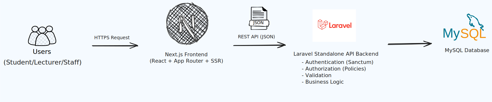

# 📚 RUDY (Ruang Study)

> **Currently under active redevelopment.**

RUDY (Ruang Study) is a modern web-based room reservation system designed to streamline the process of borrowing study rooms in a library. This project is currently being rebuilt from scratch using a modern API-first architecture to improve scalability, maintainability, security, and developer experience.

The previous version was developed using PHP Native (MVC). This repository contains the next generation of RUDY powered by **Laravel as a Standalone REST API** and **Next.js** as the frontend application.

---

## 🚧 Project Status

**Current Phase:** Rebuilding (Work in Progress)

This project is under active development. Features, APIs, and documentation will continue to evolve throughout the development process.

---

## 🎯 Project Goals

- Build a scalable library room reservation system.
- Implement a clean RESTful API architecture.
- Separate frontend and backend responsibilities.
- Follow modern software engineering best practices.
- Improve maintainability and code quality.
- Build a production-ready portfolio project.

---

## ✨ Planned Features

### 🔐 Authentication

- User Registration
- Login & Logout
- Email Verification
- Forgot Password & Password Reset
- JWT Authentication
- Role-Based Access Control (RBAC)

### 👤 User Features

- Browse Available Rooms
- View Room Details
- Book a Study Room
- Booking History
- Booking Status Tracking
- User Profile Management
- Feedback Submission

### 🛠️ Administrator Features

- Dashboard Analytics
- User Management
- Account Verification
- Room Management (CRUD)
- Booking Approval & Rejection
- Booking Monitoring
- Feedback Management
- Export Reports

---

## 👥 User Roles

- Student
- Lecturer
- Educational Staff
- Administrator

---

## 🏗️ System Architecture



## 🛠️ Tech Stack

### Frontend

- Next.js
- React
- TypeScript
- Tailwind CSS
- TanStack Query
- Axios

### Backend

- Laravel
- REST API
- Eloquent ORM
- Laravel Sanctum *(or JWT - TBD)*

### Database

- MySQL

### Development Tools

- Docker *(Planned)*
- Git
- GitHub
- Composer
- npm
- Postman / Bruno

---

## 📁 Project Structure

```text
rudy/
│
├── backend/              # Laravel Standalone API
│
├── frontend/             # Next.js Application
│
├── docs/
│   ├── PRD.md
│   ├── ERD.md
│   ├── API.md
│   └── ARCHITECTURE.md
│
└── README.md
```

---

## 📋 Planned Business Rules

- Maximum booking duration is **3 hours**.
- One booking per user per day.
- Prevent overlapping room reservations.
- Validate room capacity.
- Booking requires administrator approval.
- Users can track booking status.
- Account verification is required before making reservations.

---

## 📖 Documentation

The following documentation will be added during development:

- Product Requirements Document (PRD)
- Entity Relationship Diagram (ERD)
- API Documentation
- Database Schema
- Software Architecture
- Deployment Guide

---

## 🚀 Development Roadmap

- [x] Project Planning
- [ ] Product Requirements Document (PRD)
- [ ] Database Design (ERD)
- [ ] API Design
- [ ] Laravel Backend Development
- [ ] Authentication & Authorization
- [ ] Next.js Frontend Development
- [ ] Integration Testing
- [ ] Dockerization
- [ ] Deployment

---

## 📸 Preview

Application screenshots will be added after the first functional version is completed.

---

## 🤝 Contributing

This project is currently under active development.

Suggestions, issues, and feedback are always welcome.

---

## 📄 License

This project is developed for educational and portfolio purposes.

---

## 👨‍💻 Author

**Thierry Yudha Diantha** & **Muhammad Hanif Zidan**

Student of Applied Informatics Engineering

Politeknik Negeri Jakarta