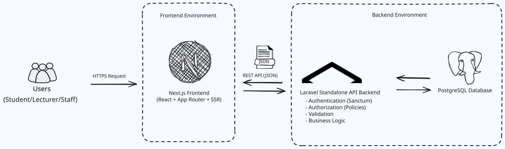
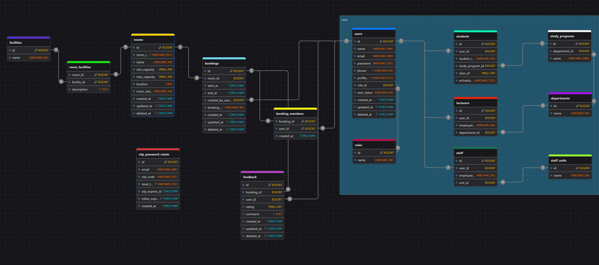

# 📚 RUDY (Ruang Study) — Library Room Reservation System

> ⚠️ **Status Proyek:** Sedang dalam tahap perombakan total arsitektur (*Active Redevelopment*).

RUDY (Ruang Study) adalah sistem peminjaman ruang belajar berbasis web modern di perpustakaan. Proyek ini dibangun ulang menggunakan arsitektur *API-First* untuk meningkatkan skala (*scalability*), kemudahan pemeliharaan (*maintainability*), dan keamanan sistem.

Versi sebelumnya dikembangkan menggunakan PHP Native (MVC). Repositori ini memuat generasi terbaru RUDY yang ditenagai oleh **Laravel sebagai Standalone REST API** dan **Next.js** pada sisi aplikasi *frontend*.

---

## 🚧 Status Pengerjaan

*   **Fase Saat Ini:** Re-Engineering & Refactoring (WIP).
*   Fitur, Dokumentasi API, dan kode program akan terus diperbarui secara berkala.

---

## 🎯 Target Proyek

*   Membangun API peminjaman ruang belajar skala komersial.
*   Menerapkan arsitektur *Clean RESTful API* & *Service Pattern*.
*   Pemisahan penuh tanggung jawab *frontend* dan *backend* (*Decoupled*).
*   Mengikuti standarisasi praktik rekayasa perangkat lunak modern.
*   Menghasilkan aplikasi siap produksi. (*production-ready*).

---

## ✨ Fitur Utama (Rencana Kerja)

### 🔐 Autentikasi & Otorisasi
*   Registrasi & aktivasi akun pengguna baru.
*   Sistem Login & Logout aman.
*   Fitur lupa kata sandi (*Password Reset*).
*   Manajemen Token menggunakan Laravel Sanctum.
*   Otorisasi berbasis peran (*Role-Based Access Control* / RBAC).

### 👤 Fitur Pengguna (Mahasiswa/Dosen)
*   Pencarian & eksplorasi ruangan tersedia.
*   Informasi detail fasilitas & kapasitas ruang.
*   Formulir reservasi ruang belajar digital.
*   Riwayat & pelacakan status peminjaman berkala.
*   Manajemen data profil mandiri.
*   Pengiriman ulasan (*feedback*) pasca-peminjaman.

### 🛠️ Fitur Administrator
*   Dasbor analitik data peminjaman perpustakaan.
*   Manajemen verifikasi akun pengguna baru.
*   Pengelolaan data ruangan (CRUD Ruangan).
*   Persetujuan & penolakan reservasi masuk.
*   Monitoring pemakaian ruang secara langsung.
*   Moderasi ulasan dan pengaduan pengguna.
*   Ekspor data laporan transaksi mingguan/bulanan.

---

## 👥 Hak Akses Pengguna

*   👨‍🎓 **Student** (Mahasiswa)
*   👨‍🏫 **Lecturer** (Dosen)
*   💼 **Educational Staff** (Tenaga Kependidikan)
*   🛡️ **Administrator** (Staf Perpustakaan)

---

## 🏗️ Arsitektur Sistem & Teknologi



### 🛠️ Kombinasi Teknologi

#### Sisi Frontend
*   Next.js (App Router)
*   React & TypeScript
*   Tailwind CSS
*   TanStack Query (React Query)
*   Axios

#### Sisi Backend
*   Laravel (Standalone REST API)
*   Eloquent ORM
*   Laravel Sanctum (Token-Based Auth)

#### Basis Data
*   PostgreSQL

#### Alat Pengembangan
*   **🐳 Docker** – Digunakan untuk *containerization* guna memastikan lingkungan pengembangan yang konsisten antara lokal dan produksi.
*   **🤖 OpenCode & CodeGraph** – Memanfaatkan *Agentic Coding AI* dan *Model Context Protocol (MCP) Server* untuk pemetaan struktur kode (*knowledge graph*), navigasi arsitektur kompleks, dan akselerasi pengembangan secara cerdas.
*   **📦 Package Managers** – Menggunakan **Composer** untuk manajemen dependensi backend (PHP) dan **npm** untuk ekosistem frontend (Node.js).
*   **🚀 Postman** – Alat utama untuk pengujian, dokumentasi, dan validasi fungsionalitas API.
*   **🐙 Git & GitHub** – Digunakan untuk kontrol versi (*version control*) dan manajemen repositori dengan penerapan alur kerja yang bersih.

---

## 🗄️ Sorotan Arsitektur Basis Data & ERD



Proyek ini menerapkan prinsip **Third Normal Form (3NF)**, **proactive concurrency control**, dan **enterprise-grade database security** untuk memastikan integritas data, skalabilitas, serta performa tetap optimal pada beban transaksi yang tinggi.

---

## 1. Manajemen Akses & Identitas (IAM) & Class Table Inheritance

### Pemisahan Autentikasi & Otorisasi
Kredensial pengguna dan proses autentikasi disimpan secara terpusat pada tabel `users`, sedangkan tingkat otorisasi dikelola secara dinamis melalui tabel master `roles`. Pendekatan ini memisahkan **authentication** dari **authorization**, sehingga sistem menjadi lebih fleksibel dan mudah dikembangkan.

### Class Table Inheritance (3NF)
Atribut khusus setiap jenis pengguna dipisahkan ke dalam tabel ekstensi dengan relasi **One-to-One**, seperti:

- `students`
- `lecturers`
- `staff`

Pendekatan **Class Table Inheritance** menjaga skema tetap memenuhi **Third Normal Form (3NF)** dengan menghilangkan *nullable sparse columns*, menghemat ruang penyimpanan, serta mempertahankan integritas atribut khusus seperti:

- `student_id_number`
- `employee_id_number`

### Workflow Verifikasi Akun
Kolom `activation_proof_path` pada tabel `students` digunakan untuk menyimpan bukti aktivasi akun aplikasi KUBACA yang nantinya dapat diverifikasi secara manual maupun otomatis agar Mahasiswa dapat memiliki akun RUDY.

---

## 2. Strategi Status Dinamis & Fleksibilitas Bisnis (Pragmatic Schema)

### Menghindari Migrasi Mahal pada Database Produksi
Kolom status seperti:

- `user_status`
- `booking_status`

secara sengaja menggunakan tipe data **VARCHAR** dibandingkan **native ENUM** milik database.

Keputusan ini diambil untuk menghindari kebutuhan menjalankan `ALTER TABLE` yang berpotensi menyebabkan **table locking**, downtime, atau proses migrasi yang mahal ketika status baru perlu ditambahkan pada lingkungan produksi.

### Strict Typing di Level Aplikasi
Walaupun menggunakan `VARCHAR` di database, konsistensi nilai tetap dijaga melalui lapisan aplikasi menggunakan:

- PHP Native Backed Enums
- Laravel Validation
- API Request Validation

Pendekatan ini memberikan fleksibilitas tinggi tanpa mengorbankan keamanan maupun konsistensi data.

---

## 3. Peminjaman Kelompok Skala Luas & Integritas Data

### Delegasi Berbasis Audit Trail
Sistem membedakan secara jelas antara pembuat pemesanan dengan anggota kelompok.

- `created_by_user_id` menyimpan pengguna yang membuat booking.
- Tabel pivot `booking_members` menyimpan seluruh anggota yang ikut menggunakan ruangan.

Pendekatan ini menjaga audit trail tetap lengkap dan memudahkan pengembangan fitur kolaboratif di masa depan.

### Composite Primary Key
Untuk mencegah relasi ganda (duplicate relationship), sistem menggunakan **Composite Primary Key** langsung di tingkat database.

Contohnya:

```sql
PRIMARY KEY (booking_id, user_id)
```

pada tabel `booking_members`

dan

```sql
PRIMARY KEY (room_id, facility_id)
```

pada tabel `room_facilities`.

Pendekatan ini memastikan setiap pasangan relasi hanya dapat muncul satu kali.

### Aturan Foreign Key yang Presisi
Setiap relasi menerapkan aturan **ON DELETE** sesuai kebutuhan bisnis.

Contohnya:

- `ON DELETE CASCADE` pada `feedbacks.booking_id` agar feedback otomatis dihapus ketika booking dihapus.
- `ON DELETE RESTRICT` pada data historis pengguna agar jejak audit tetap terjaga dan tidak dapat dihapus secara tidak sengaja.

---

## 4. Rekayasa Performa & High-Concurrency Handling

### Compound Indexing
Untuk mempercepat proses pengecekan bentrok jadwal (schedule conflict), tabel `bookings` menggunakan indeks multikolom:

```sql
(room_id, start_at, end_at)
```

Indeks ini mengoptimalkan pencarian rentang waktu sehingga performa tetap stabil meskipun jumlah transaksi meningkat.

### Pencegahan Race Condition
Arsitektur dirancang untuk mendukung mekanisme:

- Database Transactions
- Pessimistic Locking (`lockForUpdate()`)

melalui Laravel ORM.

Strategi ini mencegah terjadinya **double-booking** ketika beberapa pengguna melakukan reservasi ruangan yang sama pada waktu yang hampir bersamaan (dalam hitungan milidetik).

### Preservasi Data Analitik
Entitas utama disarankan menggunakan mekanisme **Soft Delete** (`deleted_at`), di antaranya:

- `users`
- `rooms`
- `bookings`
- `feedbacks`

Soft Delete memungkinkan data historis tetap tersedia untuk:

- kebutuhan audit,
- analisis bisnis,
- pelaporan,
- machine learning,
- dan data warehouse,

tanpa mengganggu operasi aplikasi sehari-hari.

### Database Optimization Insights
- **Scalability:** Menggunakan bawaan `BigInteger` pada tabel inti (`users`, `bookings`) untuk mendukung skalabilitas jangka panjang dan mencegah overflow data.
- **Storage Efficiency:** Mengoptimalkan tabel master seperti `roles` dan `departments` menggunakan `TinyInteger/SmallInteger` untuk menghemat ruang penyimpanan indeks database hingga 75% pada tabel relasi.


---

## Ringkasan Arsitektur

| Area | Pendekatan |
|------|------------|
| Database Normalization | Third Normal Form (3NF) |
| Authentication | Centralized Users Table |
| Authorization | Role-Based Access Control (RBAC) |
| Inheritance Strategy | Class Table Inheritance |
| Status Management | VARCHAR + PHP Native Backed Enums |
| Many-to-Many Integrity | Composite Primary Keys |
| Concurrency Control | Transactions + Pessimistic Locking |
| Query Optimization | Compound Indexes |
| Audit Strategy | Foreign Key Rules + Soft Deletes |
| Scalability | Enterprise-Oriented Relational Schema |

---

## 📁 Struktur Folder Proyek

```text
rudy/
│
├── backend/              # Laravel Standalone API
│
├── frontend/             # Next.js Application
│
├── docs/                 # Berkas Panduan & Dokumentasi Arsitektur
│   ├── PRD.md
│   ├── ERD.md
│   ├── API.md
│   └── ARCHITECTURE.md
│
└── README.md
```

---

## 📋 Aturan Bisnis Sistem (Business Rules)

*   Durasi maksimal peminjaman ruangan adalah **3 jam**.
*   Jatah boking dibatasi maksimal **1 kali per pengguna per hari**.
*   Sistem wajib **mencegah jadwal peminjaman bentrok** di waktu dan ruang yang sama.
*   Validasi otomatis kapasitas ruang terhadap jumlah anggota kelompok.
*   Setiap pengajuan boking membutuhkan persetujuan manual dari Administrator.
*   Akun pengguna wajib melalui tahap verifikasi admin sebelum dapat melakukan reservasi.

---

## 📖 Dokumentasi Teknis

Berkas dokumentasi berikut akan dilengkapi secara bertahap selama masa pengembangan:
*   Product Requirements Document (PRD)
*   Entity Relationship Diagram (ERD) Spesifikasi
*   Dokumentasi Endpoint API (OpenAPI/Swagger)
*   Skema Migrasi Database
*   Panduan Pemasangan Lokal & Deployment (Docker Guide)

---

## 🚀 Rencana Alur Pengembangan (Roadmap)

- [x] Perencanaan Proyek & Desain ERD
- [ ] Penyusunan Product Requirements Document (PRD)
- [ ] Finalisasi Desain Endpoint API
- [ ] Inisialisasi Backend Laravel & Setup Docker
- [ ] Implementasi Autentikasi Sanctum & Middleware RBAC
- [ ] Pembuatan Logika Inti Service & Repository Interface Pattern (Peminjaman Ruang)
- [ ] Inisialisasi Frontend Next.js & Integrasi API
- [ ] Pengujian Sistem secara Menyeluruh (*Integration Testing*)
- [ ] Deployment ke Server Publik

---

## 🤝 Kontribusi

Proyek ini dikembangkan secara aktif untuk kebutuhan riset pribadi dan pengembangan portofolio. Saran, kritik, dan laporan *bug* melalui halaman *Issues* sangat kami apresiasi.

---

## 📄 Lisensi

Dikembangkan murni untuk kepentingan edukasi, pembelajaran arsitektur, dan portofolio profesional.

---

## 👨‍💻 Tim Pengembang

*   **Thierry Yudha Diantha** — *Applied Informatics Engineering Student, Politeknik Negeri Jakarta*
*   **Muhammad Hanif Zidan** — *Applied Informatics Engineering Student, Politeknik Negeri Jakarta*
